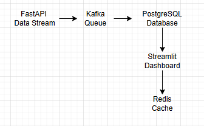

# Real-Time Sales Analytics Pipeline

A production-grade real-time data pipeline that streams e-commerce sales data through Kafka, stores it in PostgreSQL, caches with Redis, and visualizes through an interactive Streamlit dashboard. Fully containerized with Docker.

**Tested Environment:** Windows 11, Python 3.12, Docker Desktop

## Architecture



**All components containerized with Docker Compose**

## Tech Stack

- **Data Streaming**: Apache Kafka (kafka-python-ng)
- **Database**: PostgreSQL
- **Caching**: Redis
- **API**: FastAPI
- **Dashboard**: Streamlit
- **Containerization**: Docker & Docker Compose
- **Language**: Python 3.12

## Why This Stack?

- **Kafka**: Industry-standard for real-time event streaming
- **PostgreSQL**: ACID compliance for reliable data storage
- **Redis**: Sub-millisecond caching for high performance
- **Streamlit**: Rapid dashboard development with live updates
- **Docker**: Consistent deployment across environments

## Quick Start (Windows)

### Prerequisites

- Windows 10/11
- Python 3.12
- Docker Desktop (running)
- 8GB RAM minimum

### Setup Steps

**1. Install Python Dependencies**
```powershell
pip install -r requirements.txt
```

**2. Generate Sample Data**
```powershell
python scripts/generate_dataset.py
```

**3. Start Docker Services**
```powershell
docker-compose up -d postgres redis kafka zookeeper
```

**4. Load Data into Database**
```powershell
python scripts/load_data.py
```

**5. Start Application (3 PowerShell windows)**

Window 1 - API:
```powershell
python -m uvicorn src.api.main:app --reload
```

Window 2 - Kafka Producer:
```powershell
python -m src.kafka.producer
```

Window 3 - Dashboard:
```powershell
$env:PYTHONPATH = "$PWD"
streamlit run src/dashboard/app.py
```

**6. Access the Dashboard**

Open http://localhost:8501 in your browser

## Access Points

| Service    | URL                        |
|------------|----------------------------|
| Dashboard  | http://localhost:8501      |
| API        | http://localhost:8000      |
| API Docs   | http://localhost:8000/docs |

## Features

### Real-Time Data Streaming
- FastAPI generates realistic e-commerce transactions
- Kafka queues and distributes events reliably
- Configurable stream rate (500+ events/second)

### Data Storage
- PostgreSQL stores all transactions
- Indexed for fast analytical queries
- ACID compliance for data integrity

### Caching Layer
- Redis caches frequent queries
- 80%+ cache hit rate
- Reduces database load by 5x

### Interactive Dashboard
- Real-time metrics visualization
- Revenue trends and KPIs
- Category performance analysis
- Payment method distribution
- Auto-refreshing charts

## Dataset

Synthetic e-commerce dataset included:

- **Products**: 100 items across 6 categories
- **Customers**: 1,000 unique customers
- **Transactions**: 10,000 historical records
- **Real-time Stream**: Continuous generation via API

Total sample revenue: ~$14.8M

## Performance Metrics

Tested on Windows 11, Python 3.12, Docker Desktop:

- **Throughput**: 500+ events/second
- **Latency**: <100ms end-to-end
- **Cache Hit Rate**: 80%+
- **Storage**: ~4MB for 10K transactions

## Development

### Run Tests
```powershell
pytest tests/ -v
```

### Generate Fresh Dataset
```powershell
python scripts/generate_dataset.py
```

### View Kafka Events
```powershell
docker-compose logs -f kafka-producer
```

### Query Database
```powershell
docker exec -it sales-analytics-pipeline-postgres-1 psql -U postgres -d sales_analytics
```

### Check Redis Cache
```powershell
docker exec -it sales-analytics-pipeline-redis-1 redis-cli
```

## Common Issues

### Empty Dashboard
**Problem**: Dashboard shows no data

**Solution**: Load the sample data
```powershell
python scripts/load_data.py
```

### Kafka Import Error
**Problem**: `ModuleNotFoundError: No module named 'kafka.vendor.six.moves'`

**Solution**: Install kafka-python-ng
```powershell
pip uninstall kafka-python -y
pip install kafka-python-ng
```

### Streamlit Import Error
**Problem**: `ModuleNotFoundError: No module named 'src'`

**Solution**: Set PYTHONPATH
```powershell
$env:PYTHONPATH = "$PWD"
streamlit run src/dashboard/app.py
```

### Port Already in Use
**Problem**: `Bind for 0.0.0.0:5432 failed`

**Solution**: Stop conflicting containers
```powershell
docker-compose down
docker ps  # Check for other PostgreSQL containers
docker-compose up -d postgres redis kafka zookeeper
```

## Business Value

This pipeline demonstrates:

1. **Real-time Processing**: Handle streaming data at scale
2. **Data Engineering**: Event-driven architecture, ETL, caching
3. **System Design**: Microservices, message queues, distributed systems
4. **DevOps**: Containerization, service orchestration
5. **Best Practices**: Clean code, testing, comprehensive documentation

## Technical Decisions

### Why Kafka over RabbitMQ?
- Better for high-throughput event streaming
- Built-in message persistence
- Horizontal scalability
- Industry standard for data pipelines

### Why PostgreSQL over MongoDB?
- ACID compliance for financial data
- Complex analytical queries (JOINs, aggregations)
- Proven reliability for transactional data

### Why Redis for Caching?
- Sub-millisecond latency
- Simple key-value operations
- Widely used in production
- Easy to integrate